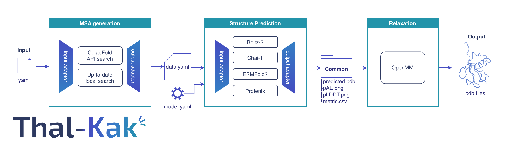

<p align="center">
  
  
</p>

# Thal-Kak

A modular structure-prediction pipeline that runs multiple protein and nucleic-acid
structure predictors through a single interface. Starting from an input FASTA, it
generates an MSA, runs the selected predictor across multiple seeds, selects the
top-5 models based on the predictor's own confidence score, and relaxes them.

**Try it in Colab (protein targets):**
[](https://colab.research.google.com/github/CSSB-SNU/Thal-Kak/blob/main/Thalkak.ipynb)

> Click the badge, choose a **GPU** runtime (`Runtime → Change runtime type → GPU`),
> then `Runtime → Run all`. The environment installs in ~3 min (pixi); the
> first run also downloads model weights (a few minutes).

## Pipeline overview

<div align="center">
  
</div>

The pipeline consists of three modular stages, each of which can be run independently through the `thalkak` CLI:

- **MSA generation:** converts the input FASTA and stoichiometry into a normalized
  `data.yaml` file using ColabFold for proteins and NHMMER for nucleic acids.
- **Structure prediction:** takes `data.yaml` and a model config, dispatches to
  one of the supported backends, and flattens every output into a shared
  `common/` directory (decoy PDBs + PAE/pLDDT plots + a confidence CSV).
- **Relaxation:** relaxes the selected top-5 models and writes refined PDBs.

`thalkak full` composes MSA → Structure → top-5 selection → Relax.

### Available options
| Stage | Options |
|-------|---------|
| MSA (`--msa`) | `colab`, `custom`, `mmseqs_local`, `hhblits_local`, `mmseqs_hhblits_local` |
| Structure (`--structure`) | `boltz2`, `chai1`, `protenix_v1`, `protenix_v2`, `esmfold2` |
| Relaxation (`--relax`) | `none`, `openmm` |

The `colab` MSA uses the remote ColabFold server and needs no local database.
The `*_local` modes run local mmseqs / HHblits searches and require the local MSA
databases under `db/` (installed with `install_db.sh`, below). `custom` searches
nothing: it takes an alignment you already have (`a3m_path`).

Per-stage documentation:
- [readme/MSA.md](readme/MSA.md): ColabFold MSA and templates; RNA chains are routed through NHMMER. The local `*_local` engines are documented under [MSA/local_msa](MSA/local_msa/README.md) and [MSA/local_template](MSA/local_template/README.md).
- [readme/Structure.md](readme/Structure.md): Boltz-2, Chai-1, Protenix, and ESMFold2 runners, plus data/model YAML schemas.
- [readme/Relax.md](readme/Relax.md): OpenMM all-atom relaxation with pLDDT-weighted restraints.

### Data flow in `full` mode
```
  FASTA + stoichiometry
    │
    ▼
  [MSA]   ──►  msa/<method>/*.a3m  +  method_log.yaml  +  <target>.yaml (data yaml)
    │
    ▼
[Structure]  ──►  structure/<model>_results_<target>_<job>/common/
                       ├── *.pdb
                       ├── *_results_summary.csv   (confidence)
                       ├── *.png
                       └── method_log.yaml         (msa + structure)
    │
    ▼
 [top-5]  ──►  top5/<job>/model_{1..5}.pdb + method_log.yaml
    │         (ranked by the model's own confidence; bond length validated)
    ▼
 [Relax]  ──►  top5/<job>/relaxed/<relax>/   (+ energies.yaml)
```

`method_log.yaml` is threaded through every stage. Each stage appends its own
choice (`msa`, `structure`, `relax`), so the output carries a provenance record.

RNA and DNA targets are automatically detected from the FASTA alphabet: RNA chains go
through an NHMMER-based MSA search, while DNA chains pass through as FASTA.

## Install

The unified `thalkak` environment bundles every backend (Boltz-2, Chai-1,
Protenix, ESMFold2, ColabFold MSA, and OpenMM relaxation) in one place. Build it
with **pixi** (recommended) or **conda**.

### Prerequisites

The prerequisites are a suitable **GPU driver** and enough **free disk** for the
pixi environment (which you build with the install steps below) and the model
checkpoints (downloaded automatically on each model's first run).

- **NVIDIA driver — CUDA >= 12.6.** `nvidia-smi` must report `CUDA Version` >= 12.6
  (driver ~560+). With an older driver, structure prediction still runs but the
  OpenMM relaxation step fails with `CUDA_ERROR_UNSUPPORTED_PTX_VERSION (222)`.
- **Free disk — ~55 GiB** for every predictor, spent on:

| Item | Location | Size |
|---|---|---|
| pixi env | `.pixi/` | ~11 GiB |
| Boltz-2 checkpoint | `~/.boltz` | 7.6 GiB |
| Chai-1 checkpoint | `Structure/submodules/chai-lab/downloads/` | 6.6 GiB |
| Protenix checkpoint | `Structure/submodules/protenix/{checkpoint,common}/` | 2.4 GiB (`protenix_v2`; +1.4 GiB to also run `protenix_v1`) |
| ESMFold2 checkpoint | `~/.cache/huggingface/` (ESM-C 6B backbone) | 25 GiB |

The local databases add much more: the RNA database (`db/rna`, ~70 GiB free
while it builds, 28 GiB kept — required for RNA or RNP targets) and the
`*_local` protein-MSA databases (`db/`, 1.9 TiB for `mmseqs_local` with
templates, 5.4 TiB for every family). See
[Local MSA databases](#local-msa-databases) below.

### With pixi (recommended)

[pixi](https://pixi.sh) builds the environment from the committed lockfile
(`pixi.lock`) with no dependency solve — fast and reproducible — and installs
the `thalkak` CLI (plus the vendored `chai_lab` / `protenix`) into the env.

```bash
# 1. Install pixi (skip if you already have it), then restart your shell
curl -fsSL https://pixi.sh/install.sh | bash

# 2. From the repo root: create the env from pixi.lock (no dependency solve)
pixi install

# 3. Apply the ColabFold templates patch (idempotent, safe to re-run)
pixi run postinstall
```

Run the pipeline through the env — per command, or in an activated shell:

```bash
pixi run thalkak full --input examples/input.yaml
# or:
pixi shell            # activate the env
thalkak full --input examples/input.yaml
```

### With conda

```bash
bash install.sh       # then: conda activate thalkak
```

This builds the same environment from `environment.yml` plus the `--no-deps`
packages in `requirements-nodeps.txt`. See the comments at the top of
`install.sh` for the exact steps.

### Local MSA databases

`install_db.sh` at the repository root installs everything the local searches
read, into `<repo>/db/`. Four families:

| Family | Needed by | Installed |
|---|---|---:|
| `rna` | any RNA or RNP target — Rfam + RNAcentral, searched with NHMMER | 28 GiB |
| `template` | template search on any `*_local` mode | 81 GiB |
| `mmseqs` | `--msa mmseqs_local`, `--msa mmseqs_hhblits_local` | 1.8 TiB |
| `hhblits` | `--msa hhblits_local`, `--msa mmseqs_hhblits_local` | 3.5 TiB |

**Any RNA or RNP target needs `rna` installed, `--msa colab` included.** The
ColabFold API returns protein alignments only, so an RNA chain has no remote
fallback: without these databases `msa_generation` refuses rather than align an
RNA chain against nothing.

For protein chains you choose: `--msa colab` searches the remote ColabFold
server and needs nothing local, while the `*_local` modes search locally and read
`mmseqs` and/or `hhblits`, plus `template` for their template search.

Installing the local MSA and template databases is covered in
[install/README.md](install/README.md). Where the databases live is set by
`db_paths.yaml` at the repository root.

### Model weights and vendored sources

Each structure-prediction model downloads its own weights to its default cache
location on first run (e.g. `~/.boltz` for Boltz-2, `~/.cache/huggingface` for
ESMFold2).

`protenix_v2` is an exception: its official `protenix-v2` checkpoint endpoint
currently returns HTTP 403 for public requests. When the checkpoint is missing,
the pipeline downloads it from a community mirror and verifies it against a
pinned SHA-256 before use (a mismatch aborts the run). To supply your own copy
instead, place `protenix-v2.pt` in the protenix checkpoint directory
(`$PROTENIX_CHECKPOINT_DIR` if set, otherwise
`Structure/submodules/protenix/checkpoint/`). `protenix_v1` is unaffected — its
checkpoint still downloads from the official endpoint.

The vendored model sources live under `Structure/submodules/` and were pulled in
as git subtrees; see [readme/subtrees.yaml](readme/subtrees.yaml) for their
upstream origins.

## Usage

> Activate the environment first (`pixi shell`, or `conda activate thalkak`), or
> prefix each command with `pixi run`.

### Full pipeline

`full` is driven by a single Method + Entity input yaml:
```
thalkak full --input examples/input.yaml
```

The input yaml has two sections (see the worked example above and
`thalkak full -h`):

- **`Method`** — `jobname`, `msa`, `structure`, `relax`; plus optional
  `top5_metric` (which confidence metric ranks the top-5: `ranking_score` |
  `ptm` | `iptm` | `plddt`, default `ranking_score`), `n_seed` (default 5),
  `seed_start` (default 1), `msa_config` (local modes), `model_config` (a
  combined config keyed by model, so it also covers a `structure` sweep),
  `relax_config`, and `base_dir` (default: the input file's directory).
  **`structure` is the only field that may be a list** — give it several models
  to run them in order against the one MSA, each with its own top-5 and
  relaxation. Every other field takes a single value; a list is an error rather
  than a silently ignored setting.
- **`Entity`** — a list of chains and ligands. Each polymer entity is
  `{type: protein|dna|rna, seq, copy}`, where `copy` is the number of chains and
  builds the stoichiometry; each ligand entity is
  `{type: ligand, smiles|ccd, copy}`. Ligands are declared here rather than in a
  separate yaml.

Listing several `structure` values runs them in order over one shared MSA; a
failure for any one model is logged and skipped, and the run ends with a
pass/fail summary.

### Individual stages
```
# MSA only (colab; the *_local modes take an optional --msa_config)
thalkak msa --msa colab --seq <target.fa> --stoi A1

# Structure only
#   The data yaml is produced by the `msa` step above, written next to the FASTA
#   as <output_dir>/<target>.yaml. Fill in job_name / output_dir / seed in it
#   before running structure prediction.
thalkak structure --model boltz2 \
    --data_config <output_dir>/<target>.yaml \
    --model_config examples/model_config.yaml

# Relax only
thalkak relax --decoy_dir <dir of decoy PDBs> --relax openmm
```

## License

Thal-Kak is Apache-2.0 ([LICENSE](LICENSE)); the vendored model code and the
databases it installs carry their own terms, listed in [NOTICE](NOTICE).
